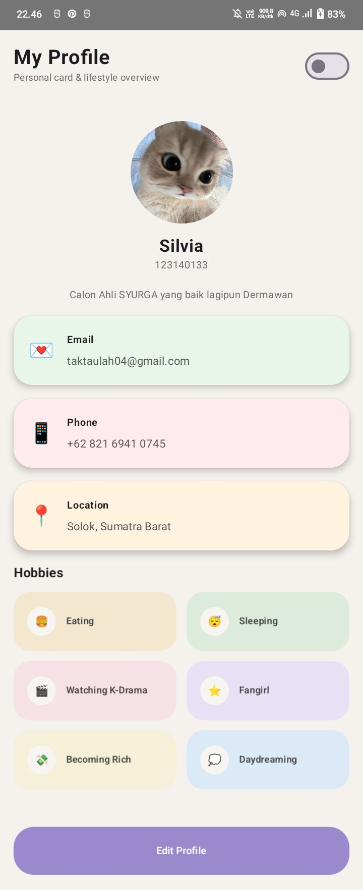
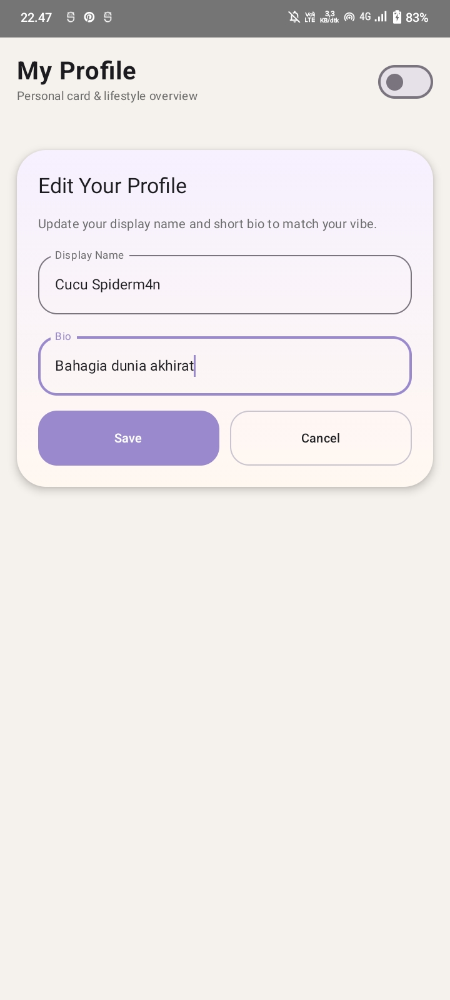
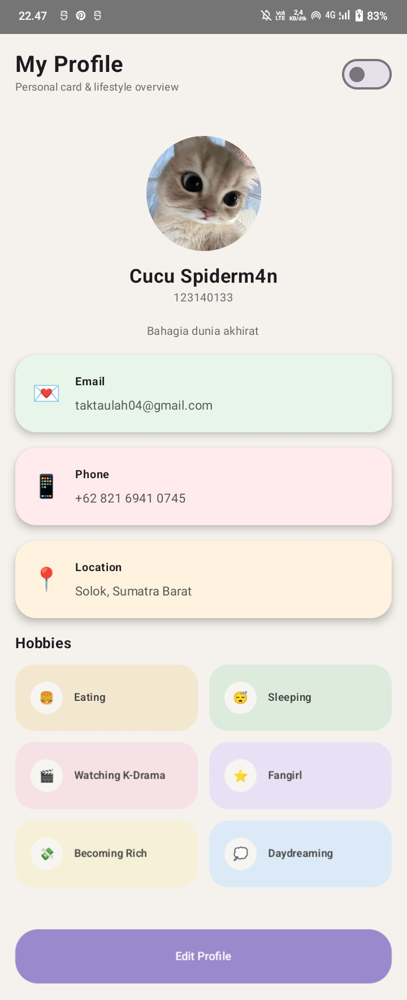
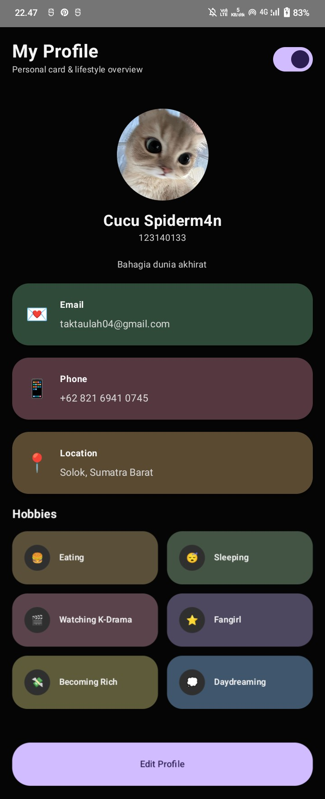

# 📱 MyProfileApp — PAM 4

Aplikasi profil mahasiswa sederhana yang dibuat menggunakan **Jetpack Compose Multiplatform** sebagai tugas pada mata kuliah **Pengembangan Aplikasi Web (PAM)**.

---

## 👤 Identitas Mahasiswa

- **Nama:** Silvia  
- **NIM:** 123140133  
- **Kelas:** RB  

---

## ✨ Fitur Aplikasi

### 1. 🧩 Penerapan MVVM
- Menggunakan pola arsitektur **Model-View-ViewModel (MVVM)**
- Menggunakan **StateFlow** untuk mengelola state
- Membuat `ProfileViewModel` untuk mengatur data dan logika aplikasi
- Menggunakan `ProfileUiState` sebagai penyimpan state UI

---

### 2. ✏️ Fitur Edit Profile
- Tersedia form untuk mengubah:
  - Nama
  - Bio
- Menggunakan konsep **state hoisting** pada `TextField`
- Tombol **Save** untuk menyimpan perubahan
- Tombol **Cancel** untuk membatalkan perubahan

---

### 3. 🌙 Fitur Dark Mode
- Terdapat switch untuk mengubah mode terang dan gelap
- State disimpan di ViewModel
- Tampilan otomatis menyesuaikan dengan mode yang dipilih

---

### 4. 🎨 Tampilan UI
- Dibuat menggunakan **Jetpack Compose**
- Layout berbasis card
- Tampilan responsive dan dapat di-scroll
- Warna menyesuaikan antara light mode dan dark mode

---

## 🖼️ Tampilan Aplikasi

  
  

  
  

  
    Mode Terang &nbsp; | &nbsp; Edit Profile &nbsp; | &nbsp; Setelah Diubah &nbsp; | &nbsp; Mode Gelap
  

---

